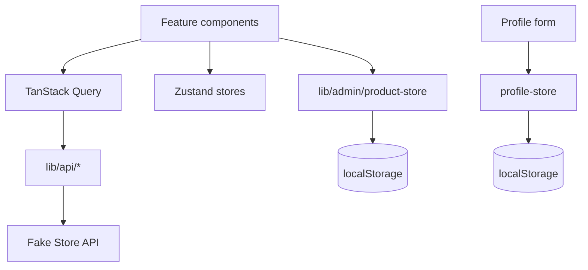

# Architecture

## Overview

**LuxeThread** is a fashion-focused e-commerce frontend portfolio. The codebase prioritizes clear layering and swap-friendly boundaries before visual polish.

## Tech stack

| Concern | Choice |
|--------|--------|
| Framework | Next.js 16 (App Router) + TypeScript |
| Styling | Tailwind CSS v4 + shadcn/ui |
| i18n | next-intl (EN / ID) |
| Server state | TanStack Query |
| Client state | Zustand (persisted cart, auth, profile, theme) |
| Forms | React Hook Form + Zod |
| API | [Fake Store API](https://fakestoreapi.com) |
| Admin writes | Local storage (`adminProductStore`) — API is read-only |

## Folder structure

```
src/
├── app/[locale]/          # Routes per locale (en, id)
├── components/
│   ├── common/            # QueryState, shared UI patterns
│   ├── features/          # Domain UI (products, cart, profile, admin…)
│   ├── layout/            # Header, footer, locale/theme toggles
│   └── ui/                # shadcn primitives
├── config/                # site + env
├── constants/             # query keys, route helpers
├── hooks/queries/         # TanStack Query hooks
├── i18n/                  # next-intl routing + navigation
├── lib/
│   ├── api/               # HTTP client + Fake Store endpoints
│   ├── admin/             # Local admin product store
│   └── profile/           # Merge API user + local overrides
├── messages/              # en.json, id.json
├── providers/             # Query, theme, toaster
├── stores/                # Zustand slices
└── types/                 # Shared TypeScript types
```

## Data flow



### Fashion catalog filter

Fake Store returns many categories. `getProducts()` filters to:

- `men's clothing`
- `women's clothing`
- `jewelery`

Configured in `src/config/site.ts`.

### Auth

- Login POSTs to `/auth/login` → stores token + `userId` in `auth-store`.
- Profile loads user from `/users/:id` and merges `profile-store` overrides (including photo as data URL).

### Admin

- Seeds from API products once, then CRUD in `localStorage`.
- Documented limitation: demonstrates admin UX without a real backend.

## Routes

| Path | Purpose |
|------|---------|
| `/[locale]` | Home |
| `/[locale]/products` | Catalog + filters |
| `/[locale]/products/[id]` | Product detail |
| `/[locale]/cart` | Cart |
| `/[locale]/checkout` | Mock checkout |
| `/[locale]/order/success` | Order confirmation |
| `/[locale]/login` | Auth |
| `/[locale]/profile` | Profile edit (guarded) |
| `/[locale]/admin` | Admin hub (guarded) |
| `/[locale]/admin/products` | Admin CRUD table |

## Phase plan

1. **Done (architecture)** — Structure, API layer, state, routes, minimal UI.
2. **Next (design)** — Apply your visual references, typography, motion.
3. **Then** — Skeleton polish, page transitions, cart drawer, stricter a11y audit.
